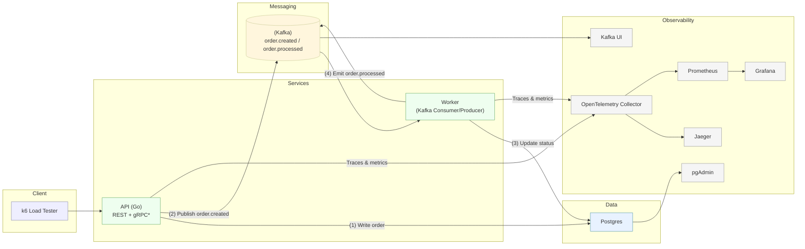

# tbd — tiny, but distributed

A **tiny, but real distributed system** built for learning and demonstration purposes.  
It uses **Go**, **PostgreSQL**, **Kafka**, and **Docker Compose** to showcase API design, event-driven processing, observability, and idempotency.

---

## 🧩 Overview

`tbd` simulates a simple **Order Processing System** — small enough to run locally, but rich enough to demonstrate real distributed system concepts:

- RESTful API (later gRPC)
- PostgreSQL database
- Kafka-based event stream
- Background worker for async processing
- OpenTelemetry tracing + Prometheus metrics + Grafana dashboards
- Jaeger for distributed tracing
- pgAdmin and Kafka UI for observability

---

## ⚙️ Architecture



* gRPC support planned later


---

## 🧠 Core Concepts

### Entities
**Order**
```json
{
  "id": "uuid",
  "customer_email": "user@example.com",
  "amount_cents": 1299,
  "status": "pending|processing|completed|failed|canceled",
  "created_at": "...",
  "updated_at": "..."
}
```

---

## 🚀 Components (Docker Compose)

| Service         | Purpose |
|-----------------|----------|
| **api**         | Go REST API (later gRPC), exposes `/v1/orders` endpoints |
| **worker**      | Kafka consumer/producer; processes `order.created` events |
| **postgres**    | Relational DB for orders |
| **pgadmin**     | Database UI on port `5050` |
| **kafka**       | Message broker (single-node cluster or Redpanda) |
| **kafka-ui**    | Kafka topic browser on port `8082` |
| **otel-collector** | Receives traces/metrics from services |
| **jaeger**      | Distributed tracing UI on port `16686` |
| **prometheus**  | Metrics collection on port `9090` |
| **grafana**     | Dashboards on port `3000` |

---

## 🌐 API Endpoints

| Method | Path | Description |
|--------|------|-------------|
| `GET` | `/healthz` | Liveness check |
| `GET` | `/readyz` | Readiness (checks DB + Kafka) |
| `GET` | `/metrics` | Prometheus scrape endpoint |
| `POST` | `/v1/orders` | Create order (requires `Idempotency-Key` header) |
| `GET` | `/v1/orders/{id}` | Retrieve order by ID |
| `GET` | `/v1/orders` | List orders (`?status=&page=&page_size=`) |
| `POST` | `/v1/orders/{id}/cancel` | Cancel pending order |

---

## 🔁 Idempotency-Key

Use an `Idempotency-Key` header for **POST /v1/orders** to ensure safe retries.

**Example:**
```bash
curl -X POST http://localhost:8080/v1/orders   -H "Content-Type: application/json"   -H "Idempotency-Key: $(uuidgen)"   -d '{"customer_email":"a@b.com","amount_cents":1234}'
```

### How it works
- The API stores `{ key, request_hash, response, order_id }` for each key.
- Repeated calls with the same key **replay** the original response.
- Prevents duplicate orders on network retries.
- TTL for dedup cache: 24–72h (configurable).

> **Note:** `Idempotency-Key` ≠ `If-Match`.  
> `If-Match` (with ETags) handles concurrency for updates.  
> `Idempotency-Key` deduplicates **retries** of the same create request.

---

## 🔄 Kafka Topics

| Topic | Description |
|--------|-------------|
| `order.created` | Emitted by API when a new order is created |
| `order.processed` | Emitted by Worker after successful processing |
| `order.failed` | Emitted by Worker on failure |
| `order.dlq` | Dead letter queue for poison messages |

---

## 🧰 Local Development

### Prerequisites
- Docker + Docker Compose
- Go ≥ 1.22
- make (optional)
- k6 (for load testing)

### Run everything
```bash
docker compose up --build
```

Check UIs:
- API → [http://localhost:8080](http://localhost:8080)
- pgAdmin → [http://localhost:5050](http://localhost:5050)
- Kafka UI → [http://localhost:8082](http://localhost:8082)
- Jaeger → [http://localhost:16686](http://localhost:16686)
- Prometheus → [http://localhost:9090](http://localhost:9090)
- Grafana → [http://localhost:3000](http://localhost:3000)

---

## 📈 Observability

| Component | Tool | Notes |
|------------|------|-------|
| Tracing | **OpenTelemetry + Jaeger** | Follow request → event → processing trace |
| Metrics | **Prometheus + Grafana** | HTTP latency, Kafka lag, worker stats |
| Logs | **Structured JSON** | Includes `trace_id`, `span_id`, `order_id` |

---

## 🧪 Load Testing (k6)

Example script: `loadtest/orders.js`
```javascript
import http from 'k6/http';
import { check } from 'k6';
import { uuidv4 } from 'https://jslib.k6.io/k6-utils/1.4.0/index.js';

export let options = { vus: 20, duration: '30s' };

export default function () {
  const headers = {
    'Content-Type': 'application/json',
    'Idempotency-Key': uuidv4(),
  };
  const body = JSON.stringify({
    customer_email: `user${__VU}@example.com`,
    amount_cents: 1999,
  });

  const res = http.post('http://localhost:8080/v1/orders', body, { headers });
  check(res, { 'status 202': (r) => r.status === 202 });
}
```

Run:
```bash
k6 run loadtest/orders.js
```

---

## 🔍 Logs & Monitoring

```bash
# Tail service logs
docker compose logs -f api
docker compose logs -f worker

# Inspect recent Kafka messages
docker exec -it kafka kafka-console-consumer   --bootstrap-server localhost:9092 --topic order.created --from-beginning
```

---

## 🧮 Scaling Locally

You can simulate a “real” distributed system by running multiple service replicas:

```bash
docker compose up --scale api=2 --scale worker=3
```

- Kafka handles consumer groups and partition rebalancing.
- The API remains stateless; load balances naturally under Compose.

For advanced simulation:
- Add artificial latency with `tc netem`.
- Kill a worker to observe offset recovery.
- Stop Kafka briefly and observe retry/backpressure.

---

## 🔧 Future Extensions

| Feature | Description |
|----------|-------------|
| **gRPC API** | Mirror the REST endpoints using Protobuf |
| **ghz testing** | Benchmark gRPC latency and throughput |
| **Outbox pattern** | Atomic DB write + event publish |
| **Saga orchestration** | Multi-step distributed workflows |
| **Service auth** | mTLS or JWT for inter-service calls |
| **Kubernetes** | Run the same topology with k3d or kind |

---

## 📂 Suggested Directory Layout

```
tbd/
├── cmd/
│   ├── api/               # main.go wires http + use cases + adapters
│   └── worker/            # main.go wires kafka consumer + use cases
├── internal/
│   ├── orders/
│   │   ├── domain/
│   │   │   ├── order.go
│   │   │   └── status.go
│   │   ├── app/
│   │   │   ├── commands/
│   │   │   │   ├── create_order.go
│   │   │   │   ├── cancel_order.go
│   │   │   │   └── mark_processed.go
│   │   │   └── queries/
│   │   │       ├── get_order.go
│   │   │       └── list_orders.go
│   │   ├── ports/
│   │   │   ├── repository.go        # OrderRepository
│   │   │   ├── event_bus.go         # EventBus
│   │   │   └── idempotency.go       # IdempotencyStore
│   │   └── adapters/
│   │       ├── http/                # handlers, routing, validation
│   │       ├── grpc/                # later
│   │       ├── pg/                  # repository impl (pgx/sqlc)
│   │       ├── kafka/               # producer/consumer impl
│   │       └── idem/                # idem impl (postgres or redis)
│   ├── db/                          # connect, migrations runner
│   ├── kafka/                       # client setup, consumer group helper
│   ├── telemetry/                   # OTel setup, middleware
│   └── idempotency/                 # generic key store if shared
├── configs/
│   ├── docker/
│   └── grafana/
├── loadtest/
│   └── orders.js
├── migrations/
├── docker-compose.yml
├── Makefile
└── README.md
```

---

## 🧭 Design Goals

- **Tiny footprint** – everything runs locally.
- **Real semantics** – async events, retries, DLQs, idempotency.
- **Observability first** – traces, metrics, logs are first-class.
- **Language focus** – idiomatic Go with context propagation.
- **Safe failure** – at-least-once delivery with deduplication.
---

## 🧱 License

MIT License © 2025 – *tbd project contributors*

---

## 🧩 References
- [OpenTelemetry Spec](https://opentelemetry.io/docs/)
- [Kafka Design Docs](https://kafka.apache.org/documentation/)
- [Go Context Propagation](https://pkg.go.dev/context)
- [Prometheus Docs](https://prometheus.io/docs/)
- [Grafana Dashboards](https://grafana.com/grafana/)
- [Jaeger Tracing](https://www.jaegertracing.io/)
